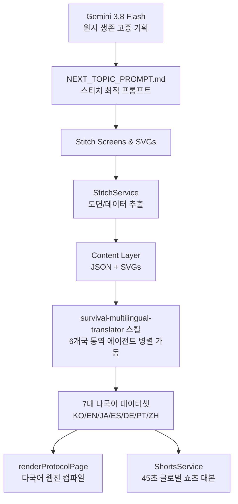

# 아카이브-0 (ARCHIVE-0) : 원시 생존 매뉴얼 웹진 & 유튜브 쇼츠 파이프라인

## 1. 프로젝트 개요
- **목적**: 인류 문명 붕괴 시 원시 인류가 생존했던 기술을 흑백 브루탈리즘 야전 교본 스타일로 디지털 아카이빙하고, 이를 45초 유튜브 쇼츠 영상으로 원소스 멀티유즈(OSMU) 자동 확장
- **글로벌 다국어 지원 (7대 언어)**:
  - `ko` (한국어), `en` (영어), `ja` (일본어), `es` (스페인어), `de` (독일어), `pt` (포르투갈어), `zh-TW` (중국어 번체)
- **디자인 철학**: 
  - Pure Monochrome Brutalism (순수 흑백, 곡선 배제, 1px/2px 그리드 선화)
  - 30초 스캔 가독성 (체크리스트 ➔ 3단계 행동 지침 ➔ 치명적 실수 반전)
  - 듀얼 모드 (야간 전술 다크모드 ↔ 재생지 인쇄 라이트모드)
- **아키텍처**: Content-Driven Layered Component Architecture (A+ 98점 검증)

## 2. 연동 아키텍처 & 데이터 흐름


## 3. 핵심 디렉토리 구조
```text
primitive-survival/
├── content/                     # [Content Layer] 순수 데이터
│   ├── protocols/               # 마스터 및 다국어 JSON
│   │   ├── 01-water-purification.json
│   │   └── locales/ (en, ja, es, de, pt, zh-tw)
│   └── svgs/                    # 1:1 공용 벡터 기술 도면
├── src/
│   ├── i18n/                    # [i18n Layer] 7대 언어 사전 및 메타데이터
│   │   ├── locales.ts           # 언어 정의 ('ko' | 'en' | 'ja' | 'es' | 'de' | 'pt' | 'zh-TW')
│   │   ├── ui-strings.ts        # UI 텍스트 사전
│   │   └── index.ts
│   ├── components/              # [Presentational Layer] 순수 UI 컴포넌트
│   │   ├── layout/ (Header with i18n switcher, StickyActionBar)
│   │   └── protocol/ (HeroSection, Checklist, StepCard, FatalWarning)
│   ├── state/                   # [State Layer] SSOT 런타임 스크립트 직렬화
│   ├── services/                # [Service Layer] Gemini, Stitch, Shorts
│   ├── types/                   # [Type Layer] Protocol, Shorts, i18n
│   ├── render.ts                # 다국어 템플릿 컴파일러
│   └── pipeline.ts              # 전체 파이프라인
└── shorts/                      # 생성된 45초 쇼츠 대본
    └── 01-water-purification/
        ├── storyboard.json
        ├── script.md            # 한국어 마스터
        └── locales/             # script.en.md, script.ja.md 등
```
